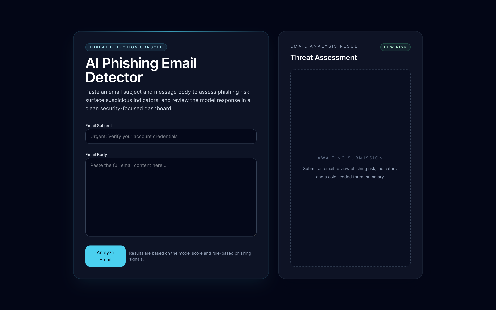
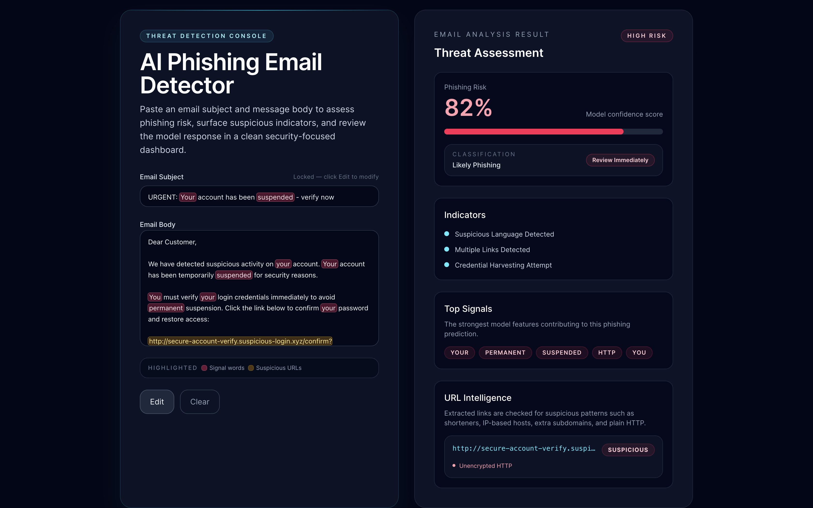
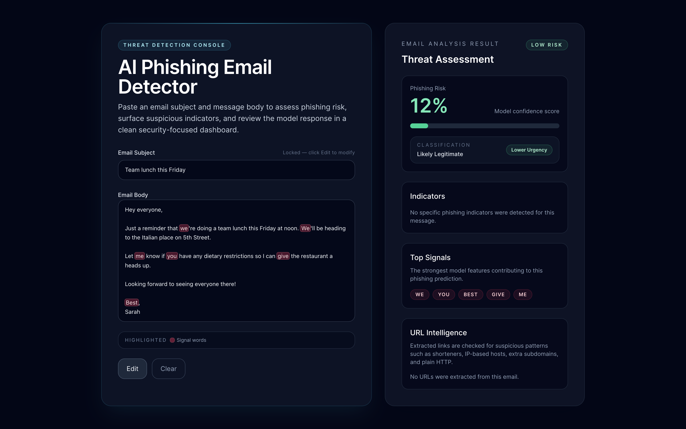

# AI Phishing Detection System

A machine-learning system that scores the phishing risk of an email from its subject and body. It uses a TF-IDF + Logistic Regression pipeline served through a FastAPI backend and a React frontend.

&nbsp;&nbsp;&nbsp;&nbsp;&nbsp;&nbsp;&nbsp;&nbsp;

---

## Table of Contents

- [Screenshots](#screenshots)
- [How It Works](#how-it-works)
- [Architecture](#architecture)
- [Dataset](#dataset)
- [Local Development](#local-development)
- [API Reference](#api-reference)
- [Deployment](#deployment)
- [Environment Variables](#environment-variables-reference)
- [Tech Stack](#tech-stack)
- [Detailed Explanation](#detailed-explanation)

---

## Screenshots

### Main Dashboard

> Submit an email subject and body to begin a threat assessment.



### High-Risk Result

> The panel displays a high phishing risk score, flagged indicators, top model signals, and URL intelligence.



### Low-Risk Result

> The panel displays a low phishing risk score, flagged indicators, top model signals, and URL intelligence.



---

## How It Works

```
Email Subject + Body
        │
        ▼
 TF-IDF Vectorizer        ← transforms raw text into numeric feature vectors
        │
        ▼
 Logistic Regression      ← outputs a phishing probability score (0.0 → 1.0)
        │
        ▼
 Rule-Based Indicators    ← regex/heuristic checks (URLs, urgency phrases, etc.)
        │
        ▼
 FastAPI /analyze         ← returns score, label, indicators, top signals, URL intel
        │
        ▼
 React Dashboard          ← renders color-coded threat assessment
```

The model is trained on two combined Kaggle datasets (≈ 80k+ labelled emails). The TF-IDF vectorizer converts email text into a bag-of-words feature matrix, which Logistic Regression uses to estimate phishing probability. Rule-based checks run in parallel to surface specific red flags regardless of model confidence.

---

## Architecture

```
frontend/          React app (deployed on Vercel)
backend/
  app/             FastAPI application
    main.py        Routes + CORS
    predictor.py   Inference logic
    model_loader.py  Cached model loading
    indicators.py  Rule-based indicator detection
  model/           Trained model artifacts (.pkl)
  train/           Production training pipeline
  Dockerfile       Container image definition
  requirements.txt Python dependencies
docs/
  screenshots/     UI screenshots for this README
```

---

## Dataset

This project uses two combined email datasets from Kaggle:

| #   | Author                                | Source                                                                                             | Accessed   |
| --- | ------------------------------------- | -------------------------------------------------------------------------------------------------- | ---------- |
| 1   | Ethan Cratchley                       | [Email Phishing Dataset](https://www.kaggle.com/datasets/ethancratchley/email-phishing-dataset)    | 2026-03-04 |
| 2   | Naser Abdullah Alam & Amith Khandakar | [Phishing Email Dataset](https://www.kaggle.com/datasets/naserabdullahalam/phishing-email-dataset) | 2026-03-12 |

---

## Local Development

### Prerequisites

- Python 3.11+
- Docker (for container testing)
- Node.js 18+ (for the frontend)

### Backend — run directly

```bash
cd backend
python -m venv .venv
source .venv/bin/activate
pip install -r requirements.txt

cp .env.example .env   # edit as needed

uvicorn app.main:app --reload --port 8000
```

| Endpoint         | URL                          |
| ---------------- | ---------------------------- |
| API              | `http://localhost:8000`      |
| Interactive docs | `http://localhost:8000/docs` |

### Backend — run via Docker

```bash
cd backend
docker build -t phishing-api .
docker run -p 8000:8000 --env-file .env phishing-api
```

### Frontend

```bash
cd frontend
cp .env.example .env   # edit VITE_API_URL if needed
npm install
npm run dev
```

### Train the model

```bash
# From the repository root
python backend/train/train_model.py
```

Artifacts are saved to `backend/model/phishing_model.pkl` and `backend/model/vectorizer.pkl`.

---

## API Reference

### `GET /`

Health check.

```json
{ "status": "ok" }
```

---

### `POST /analyze`

Score an email for phishing risk.

**Request body**

```json
{
  "subject": "Urgent: verify your account",
  "body": "Click here to confirm your password immediately."
}
```

**Response**

```json
{
  "phishing_risk": 0.9431,
  "label": "Phishing",
  "indicators": [
    "suspicious language detected",
    "credential harvesting attempt"
  ],
  "top_signals": ["verify", "urgent", "password", "click here"],
  "url_intelligence": [
    {
      "url": "http://bit.ly/3xAbc12",
      "is_suspicious": true,
      "flags": ["URL shortener detected", "plain HTTP (no TLS)"]
    }
  ]
}
```

| Field              | Type       | Description                                           |
| ------------------ | ---------- | ----------------------------------------------------- |
| `phishing_risk`    | `float`    | Probability between `0.0` (safe) and `1.0` (phishing) |
| `label`            | `string`   | Human-readable classification                         |
| `indicators`       | `string[]` | Rule-based red flags detected in the email            |
| `top_signals`      | `string[]` | Strongest TF-IDF features driving the prediction      |
| `url_intelligence` | `object[]` | Extracted URLs with suspicion flags                   |

---

## Deployment

### Backend — Render or Railway

Both platforms build and run the Docker container directly from your repository.

#### Render

1. Go to [render.com](https://render.com) and create a new **Web Service**.
2. Connect your GitHub repository.
3. Set **Root Directory** to `backend`.
4. Set **Environment** to **Docker** — Render detects the `Dockerfile` automatically.
5. Add the environment variable:

   | Key               | Value                         |
   | ----------------- | ----------------------------- |
   | `ALLOWED_ORIGINS` | `https://your-app.vercel.app` |

6. Deploy. Render exposes a public URL like `https://phishing-api.onrender.com`.

#### Railway

1. Go to [railway.app](https://railway.app) and create a new project from your GitHub repo.
2. Railway auto-detects the `Dockerfile` inside `backend/`.
3. Set **Root Directory** to `backend` in the service settings.
4. Add the environment variable:

   | Key               | Value                         |
   | ----------------- | ----------------------------- |
   | `ALLOWED_ORIGINS` | `https://your-app.vercel.app` |

5. Railway provides a public URL automatically.

---

### Frontend — Vercel

1. Go to [vercel.com](https://vercel.com) and import your GitHub repository.
2. Set **Root Directory** to `frontend`.
3. Vercel detects the framework (Vite) automatically.
4. Add the environment variable:

   | Key            | Value                                                  |
   | -------------- | ------------------------------------------------------ |
   | `VITE_API_URL` | `https://phishing-api.onrender.com` (your backend URL) |

   > If you are using Create React App instead of Vite, the variable must be named `REACT_APP_API_URL`.

5. Deploy. Vercel provides a public URL like `https://your-app.vercel.app`.
6. Copy that Vercel URL back into the backend's `ALLOWED_ORIGINS` variable on Render/Railway and redeploy the backend so CORS allows requests from your frontend.

---

## Environment Variables Reference

#### Backend (`backend/.env`)

| Variable          | Required         | Description                                                               |
| ----------------- | ---------------- | ------------------------------------------------------------------------- |
| `ALLOWED_ORIGINS` | Yes (production) | Comma-separated list of frontend origins. Defaults to `*` in development. |

#### Frontend (`frontend/.env`)

| Variable       | Required | Description                                                                 |
| -------------- | -------- | --------------------------------------------------------------------------- |
| `VITE_API_URL` | Yes      | Full URL of the deployed backend, e.g. `https://phishing-api.onrender.com`. |

---

## Tech Stack

| Layer            | Technology                                  |
| ---------------- | ------------------------------------------- |
| ML model         | scikit-learn (TF-IDF + Logistic Regression) |
| Backend          | FastAPI + Uvicorn                           |
| Container        | Docker (python:3.11-slim)                   |
| Frontend         | React (Vite) + Tailwind CSS                 |
| Backend hosting  | Render or Railway                           |
| Frontend hosting | Vercel                                      |


---

## Detailed Explanation

This section explains how the system works end to end — from raw email text through machine learning inference to the final threat assessment displayed in the UI.

---

### 1. Data Preparation

Two Kaggle datasets are merged into a single CSV (`phishing_email_content.csv`) with three columns: `subject`, `body`, and `label` (either `Legitimate` or `Phishing`). Before training, missing subjects and bodies are filled with empty strings so concatenation is always safe. The subject and body are then joined into a single `text` field:

```
text = subject + " " + body
```

This gives the model a single string per email to work with. Combining both fields ensures subject-line phishing cues (e.g. `"Urgent: verify your account"`) are weighted alongside body content.

---

### 2. Train / Test Split

The dataset is split 80% training / 20% test using scikit-learn's `train_test_split` with `stratify=y`. Stratification ensures both splits contain the same ratio of phishing to legitimate emails, preventing a skewed evaluation if the classes are imbalanced.

---

### 3. TF-IDF Vectorisation

Raw text cannot be fed directly into a mathematical model — it must first be converted into numbers. This project uses **TF-IDF** (Term Frequency–Inverse Document Frequency), a classic and highly effective text representation.

#### Term Frequency (TF)

TF measures how often a word appears in a given document. A word that appears many times in an email is likely important for describing that email.

#### Inverse Document Frequency (IDF)

IDF down-weights words that appear in almost every document (e.g. "the", "is", "a") because those words carry little discriminative power. Words that appear in only a few documents are up-weighted because they are more specific and meaningful.

The final TF-IDF score for a word is `TF × IDF` — high for words that are frequent in this email but rare across the corpus.

#### Hyperparameters used

| Parameter | Value | Reason |
|-----------|-------|--------|
| `max_features` | 10,000 | Caps the vocabulary to the 10k most informative terms to keep the model compact |
| `sublinear_tf` | `True` | Applies log-scaling to TF (`1 + log(tf)`) so a word appearing 100 times is not 100× more important than one appearing 10 times |
| `ngram_range` | `(1, 2)` | Includes both single words (unigrams) and two-word phrases (bigrams). This lets the model learn patterns like `"click here"` or `"verify account"` as single features |
| `min_df` | `2` | Ignores terms that appear in fewer than 2 documents, filtering out typos and ultra-rare noise |
| `strip_accents` | `"unicode"` | Normalises accented characters so `"vérify"` and `"verify"` map to the same feature |
| `analyzer` | `"word"` | Tokenises on word boundaries rather than character-level |

The vectorizer is fitted only on the training set and then applied (`.transform()`) to the test set, preventing any data leakage.

---

### 4. Logistic Regression Classifier

With the TF-IDF matrix built, a **Logistic Regression** model is trained to classify each email as phishing or legitimate.

Logistic Regression works by learning a weight (coefficient) for every feature in the vocabulary. During inference, it computes a weighted sum of the TF-IDF values for words present in the email and passes that sum through a **sigmoid function** to squash it into a probability between 0.0 and 1.0:

```
P(phishing) = sigmoid(w₁·x₁ + w₂·x₂ + ... + wₙ·xₙ + bias)
```

Where `wᵢ` is the learned weight for feature `i` and `xᵢ` is its TF-IDF score.

- A high positive weight on a word like `"verify"` or `"suspend"` means its presence pushes the score towards phishing.
- A high negative weight means its presence is evidence of a legitimate email.
- The sigmoid output is the `phishing_risk` score returned by the API.

#### Why Logistic Regression?

- **Well-calibrated probabilities** — the sigmoid output is a true probability, making threshold-based decisions (`≥ 0.5 → phishing`) meaningful.
- **Interpretable** — each feature has a single coefficient, so it is straightforward to explain why the model scored an email the way it did.
- **Fast** — training and inference on a 10k-feature sparse matrix is extremely quick even on a CPU.
- **Effective for text** — paired with TF-IDF, Logistic Regression is a strong baseline for document classification and often matches more complex models in practice.

#### Hyperparameters used

| Parameter | Value | Reason |
|-----------|-------|--------|
| `C` | `1.0` | Inverse regularisation strength. Default value; controls the trade-off between fitting the training data and keeping weights small |
| `solver` | `"lbfgs"` | L-BFGS is an efficient quasi-Newton optimiser well-suited to small-to-medium sparse problems |
| `max_iter` | `1000` | Allows the optimiser enough iterations to fully converge |
| `random_state` | `42` | Ensures reproducible results |

---

### 5. Model Artifacts & Integrity Verification

After training, both objects are serialised to disk using `joblib`:

```
backend/model/phishing_model.pkl    ← the trained LogisticRegression
backend/model/vectorizer.pkl        ← the fitted TfidfVectorizer
```

At startup, before loading either file, the server computes their **SHA-256 checksums** and compares them against expected values stored in companion `.sha256` manifest files (or environment variables). If the hashes do not match, the server raises an error and refuses to start. This prevents a tampered or corrupted model artifact from silently producing wrong predictions.

Once verified, the model and vectorizer are loaded once and cached in memory with `@lru_cache(maxsize=1)` so every subsequent request reuses the same objects without a disk read.

---

### 6. Inference Pipeline

When the frontend sends a `POST /analyze` request, the following steps run synchronously:

```
1. Validate input (Pydantic: subject ≤ 255 chars, body ≤ 10,000 chars)
2. Concatenate:  text = subject + " " + body
3. Vectorize:    X = vectorizer.transform([text])   → sparse TF-IDF matrix
4. Score:        P = model.predict_proba(X)[0][1]   → phishing probability
5. Label:        "Likely Phishing" if P ≥ 0.5 else "Likely Legitimate"
6. Explain:      top 5 contributing words (see §7)
7. Indicators:   rule-based keyword checks (see §8)
8. URLs:         heuristic URL analysis (see §9)
9. Return:       JSON with all five fields
```

---

### 7. Top Signals (Explainability)

To make the model's decision transparent, the explainer identifies the **top 5 words** that pushed the score towards phishing for that specific email.

For each word present in the email, its contribution is:

```
contribution(word) = TF-IDF score of word × model coefficient for word
```

The words are ranked by this value in descending order. Only words with a positive contribution (i.e. those actively pushing towards phishing) are included. These are returned as `top_signals` in the response, surfaced in the UI as labelled tags.

This approach is a lightweight alternative to SHAP/LIME — it works directly with the model's own coefficients and produces results that are accurate, interpretable, and add no inference latency.

---

### 8. Rule-Based Indicators

Running in parallel with the model, a set of deterministic regex and keyword checks surface specific red flags regardless of the model's confidence score. The current rules are:

| Check | Trigger | Indicator returned |
|-------|---------|-------------------|
| Suspicious keywords | Any of: `urgent`, `verify`, `account`, `password`, `login`, `confirm`, `click`, `suspend` | `"suspicious language detected"` |
| URL presence | Any `http://` or `https://` link in the email | `"multiple links detected"` |
| Credential harvesting | `"password"` or `"login"` appears in the text | `"credential harvesting attempt"` |

These rules catch common phishing patterns that are formulaic enough to be expressed as exact matches, without needing the model to have seen similar examples during training.

---

### 9. URL Intelligence

Every URL in the email (both fully qualified `https://` links and bare domain references like `evil.example.com/reset`) is extracted and analysed independently. For each URL the following heuristic checks are applied:

| Check | Flag raised |
|-------|------------|
| No HTTPS scheme (bare domain) | `"Missing HTTPS scheme"` |
| Hostname is a raw IP address | `"IP address instead of domain"` |
| Domain is a known URL shortener | `"URL shortener"` |
| More than 3 subdomain levels | `"Excessive subdomains"` |
| Full URL uses plain `http://` | `"Unencrypted HTTP"` |
| URL exceeds 2,048 characters | `"URL length exceeds safe threshold"` |

A URL is marked `is_suspicious: true` if it triggers at least one flag. All extracted URLs, their suspicion status, and their individual flags are returned in the `url_intelligence` array and rendered in the dashboard.